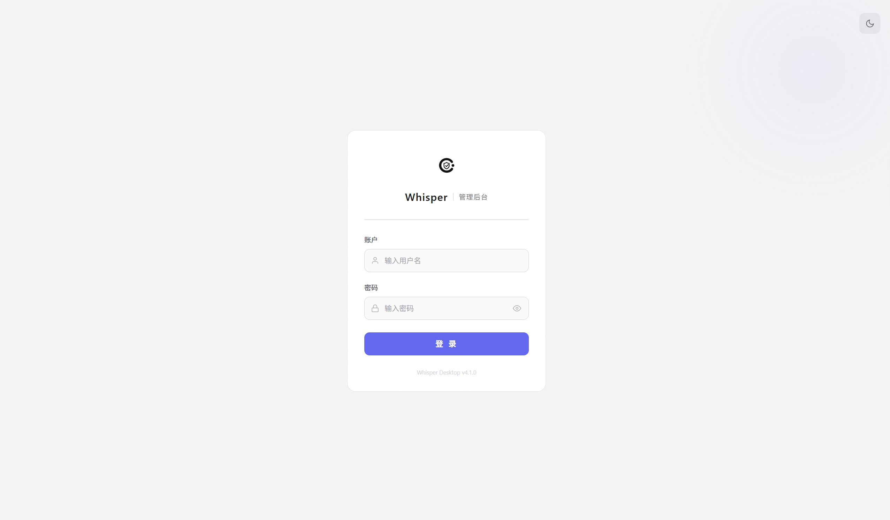
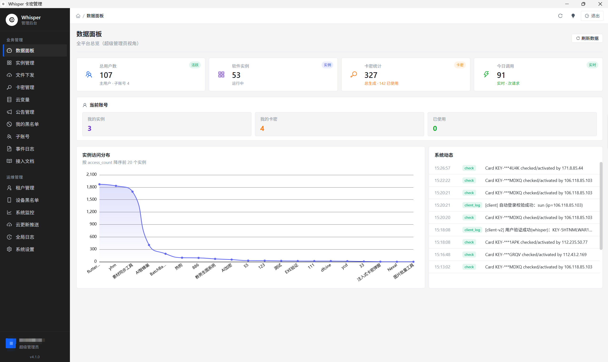
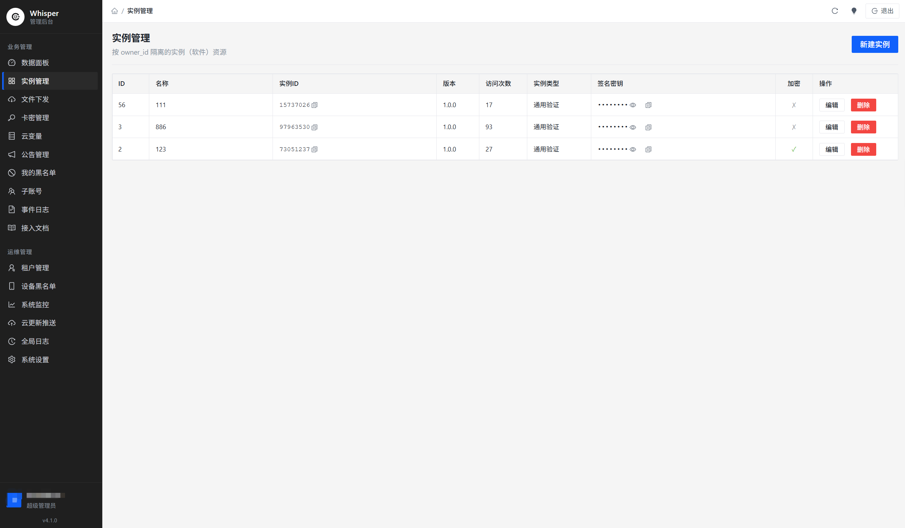
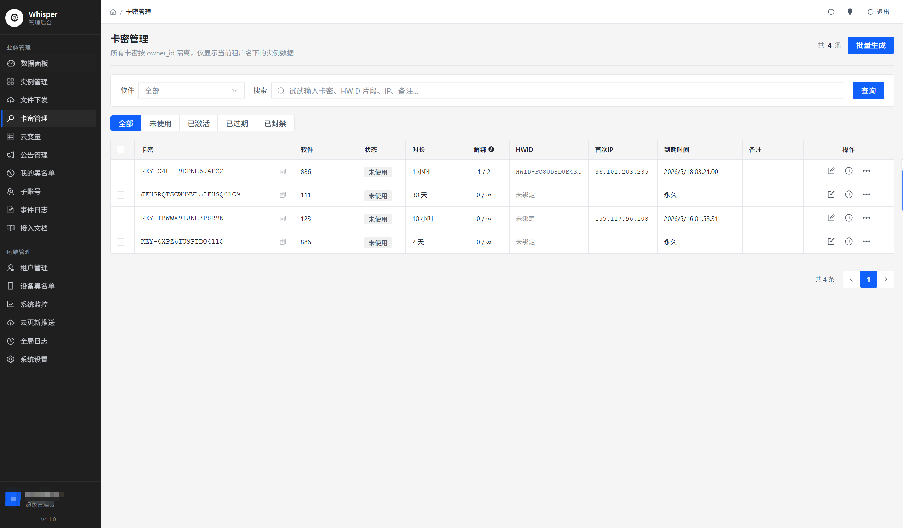
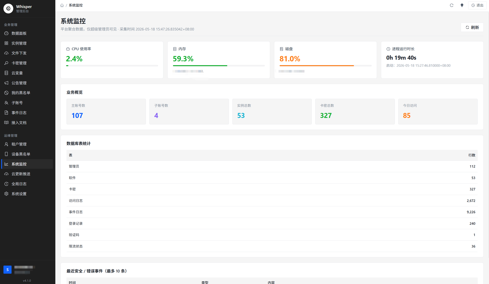

<div align="center">

# Whisper Desktop

**高性能卡密管理系统桌面客户端** — 基于 Tauri 2 + Vue 3 + Element Plus

License key management · Software instance isolation · Real-time dashboard · Multi-tenant

[](https://tauri.app)
[](https://vuejs.org)
[](https://typescriptlang.org)
[](https://element-plus.org)
[](LICENSE)

</div>

---

## 简介

Whisper Desktop 是一款面向软件开发者和 SaaS 运营商的**卡密（License Key）全生命周期管理工具**。它以原生桌面应用的形式，提供卡密生成、激活验证、机器绑定、到期管理、黑名单拦截等完整能力，同时支持**多租户隔离**和**子账号权限分配**，适用于单人开发者到中型团队的各种规模。

### 为什么选择 Whisper Desktop？

- **原生性能**：基于 Tauri 2 + Rust 后端，安装包仅 ~8 MB，内存占用远低于 Electron 方案
- **多租户隔离**：每个管理员仅可见自己名下的软件、卡密、日志，数据严格按 `owner_id` 隔离
- **权限精细控制**：超管 → 主账号 → 子账号三级权限体系，支持按功能模块授权
- **开箱即用**：Windows NSIS 安装包一键部署，配合后端 API 即可使用

---

## 界面预览

### 登录页面

支持亮色 / 暗色主题自动切换，防暴力破解锁定机制。



### 数据面板

超管全平台概览：总用户数、软件实例数、卡密统计、今日活跃，实例访问分布图 + 实时系统动态。



### 实例管理

管理多个软件实例，每个实例拥有独立的 Instance ID、签名密钥、加密开关。



### 卡密管理

卡密全生命周期：批量生成、状态筛选（未使用 / 已激活 / 已过期 / 已封禁）、HWID 绑定、解绑次数控制。



### 系统监控

超管专属运维视图：CPU / 内存 / 磁盘实时指标、数据库表行数统计、安全事件追踪。



---

## 完整功能列表

### 业务管理

| 功能 | 说明 |
|------|------|
| **卡密批量生成** | 自定义前缀、时长（小时/天）、解绑上限，一键批量创建 |
| **卡密状态管理** | 未使用 → 已激活 → 已过期 → 已封禁，全状态流转 |
| **HWID 机器绑定** | 首次激活自动绑定硬件指纹，防止一码多用 |
| **解绑次数控制** | 可配置每张卡密最大解绑次数，超限自动锁定 |
| **软件实例隔离** | 每个实例独立 Instance ID + Secret Key，互不干扰 |
| **云变量管理** | 远程下发 Key-Value 配置，客户端实时拉取 |
| **公告推送** | 按软件实例发布公告，客户端验证时自动获取 |
| **Lua 脚本下发** | 版本化管理云端脚本，客户端 SDK 按版本拉取并校验 SHA256 |

### 安全防护

| 功能 | 说明 |
|------|------|
| **IP / HWID 黑名单** | 全局 + 租户级双层黑名单拦截 |
| **设备黑名单** | 超管级设备指纹永久封禁 |
| **登录防暴力破解** | 滚动窗口计数 + 自动锁定 + tarpit 延迟 |
| **API 签名验证** | Legacy MD5 + V2 HMAC-SHA256 双模式签名 |
| **Nonce 防重放** | 每个请求唯一 nonce，服务端去重 |
| **响应体加密** | 可选 AES 加密，防抓包篡改 |

### 运维能力

| 功能 | 说明 |
|------|------|
| **实时数据面板** | ECharts 趋势图 + 多维统计卡片 |
| **系统监控** | CPU / 内存 / 磁盘 / 进程运行时长 |
| **操作日志** | 全操作审计追踪，支持按类型筛选 |
| **全局日志** | 超管跨租户日志查看 |
| **云更新推送** | 管理端推送新版本，客户端自动检测并下载安装 |
| **子账号管理** | 按功能模块（卡密创建/封禁/删除/编辑/黑名单）精细授权 |

---

## 技术栈

| 层 | 技术 | 版本 |
|---|------|------|
| 桌面框架 | [Tauri](https://tauri.app) (Rust) | 2.x |
| 前端框架 | [Vue 3](https://vuejs.org) + TypeScript | 3.5 |
| UI 组件库 | [Element Plus](https://element-plus.org) | 2.9 |
| 状态管理 | [Pinia](https://pinia.vuejs.org) | 3.x |
| 路由 | Vue Router | 4.x |
| 图表 | [ECharts](https://echarts.apache.org) + vue-echarts | 6.x |
| 图标 | [@iconify/vue](https://iconify.design) | 5.x |
| 样式 | TailwindCSS + CSS Custom Properties | 3.4 |
| HTTP | Axios | 1.7 |
| 构建工具 | [Vite](https://vite.dev) | 6.x |
| 代码混淆 | javascript-obfuscator + terser | - |

---

## 快速开始

### 环境要求

- **Node.js** >= 18
- **Rust** >= 1.77
- **npm** >= 9

### 安装与开发

```bash
# 克隆仓库
git clone https://github.com/shendehao/whisper-desktop.git
cd whisper-desktop

# 安装前端依赖
npm install

# 启动开发模式（仅前端 Hot Reload）
npm run dev

# 启动 Tauri 开发模式（前端 + Rust 原生窗口）
npm run tauri dev
```

### 构建生产版本

```bash
# 构建 Windows NSIS 安装包
npm run tauri build
```

输出路径：`src-tauri/target/release/bundle/nsis/Whisper Desktop_x.x.x_x64-setup.exe`

### 环境变量配置

复制 `.env.example` 为 `.env`，按需修改：

```env
VITE_API_BASE=https://your-api-domain.com
```

---

## 项目结构

```
whisper-desktop/
├── src/                        # Vue 3 前端源码
│   ├── api/                    # Axios API 请求层
│   │   ├── index.ts            # HTTP 实例 & 拦截器
│   │   ├── auth.ts             # 登录认证接口
│   │   └── admin.ts            # 管理端业务接口
│   ├── composables/            # 组合式函数
│   │   └── useUpdateCheck.ts   # 云更新检测
│   ├── router/                 # Vue Router 路由 & 守卫
│   ├── stores/                 # Pinia 状态管理
│   │   ├── user.ts             # 用户认证 & 会话
│   │   └── theme.ts            # 主题切换
│   ├── styles/                 # 全局样式 & CSS 变量
│   ├── views/
│   │   ├── Login.vue           # 登录页
│   │   ├── admin/              # 管理端页面
│   │   │   ├── Dashboard.vue   # 数据面板
│   │   │   ├── Cards.vue       # 卡密管理
│   │   │   ├── Software.vue    # 实例管理
│   │   │   ├── CloudVars.vue   # 云变量
│   │   │   ├── Announcements.vue # 公告管理
│   │   │   ├── Blacklist.vue   # 黑名单
│   │   │   ├── SubAccounts.vue # 子账号
│   │   │   ├── Monitor.vue     # 系统监控
│   │   │   ├── Settings.vue    # 系统设置
│   │   │   └── ...
│   │   └── client/             # 客户端验证页面
│   └── components/             # 公共组件
├── src-tauri/                  # Tauri Rust 后端
│   ├── src/
│   │   ├── lib.rs              # Tauri 插件注册
│   │   ├── main.rs             # 入口
│   │   └── updater.rs          # 自定义更新器（流式下载）
│   ├── icons/                  # 多平台应用图标
│   ├── Cargo.toml              # Rust 依赖配置
│   └── tauri.conf.json         # Tauri 窗口 & 打包配置
├── package.json
├── vite.config.ts
├── tailwind.config.js
└── tsconfig.json
```

---

## 权限体系

```
超级管理员 (superadmin)
├── 全平台数据概览
├── 租户管理（用户列表 / 重置密码）
├── 设备黑名单
├── 系统监控
├── 云更新推送
├── 全局日志
└── 系统设置

主账号 (admin)
├── 自有软件实例 CRUD
├── 卡密全功能管理
├── 云变量 / 公告 / 黑名单
├── 子账号创建与授权
├── Lua 脚本管理
└── 操作日志查看

子账号 (sub_account)
└── 按授权功能模块访问
    ├── card_create   — 卡密创建
    ├── card_ban      — 卡密封禁
    ├── card_delete    — 卡密删除
    ├── card_edit      — 卡密编辑
    └── blacklist_manage — 黑名单管理
```

---

## License

[MIT](LICENSE) — 可自由使用、修改和分发。
